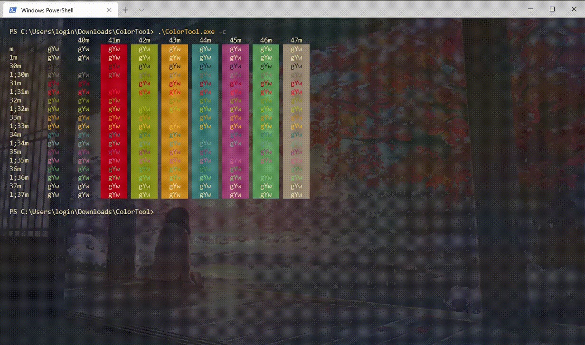

# Windows-Terminal-Settings
My settings file for windows terminal

## set up

- move to settings folder
- remove original settings
- `git clone https://github.com/Poncirus/Windows-Terminal-Settings.git .`

## update

- `git pull`
